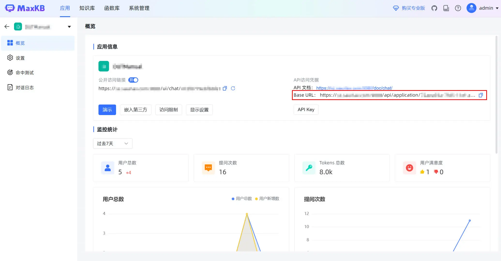

# koishi-plugin-maxkb

在 Koishi 中使用 MaxKB 知识库问答系统

## 使用方法

打开 MaxKB 应用，复制应用的 Base URL 和 API Key，然后在插件的配置中填入这两个值。

插件支持通过 `@机器人` 和正则表达式关键词两种方式触发问答，需要在配置中打开相应的开关才能生效。

- `怎么办`：匹配包含“怎么办”的问题
- `^请问`：匹配以“请问”开头的问题